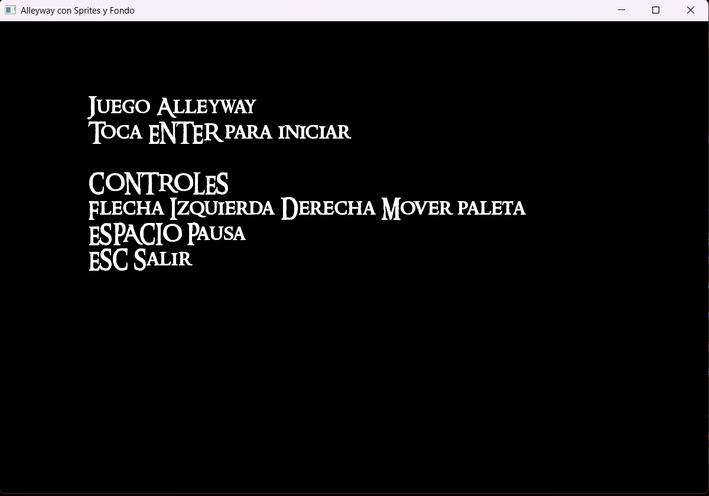
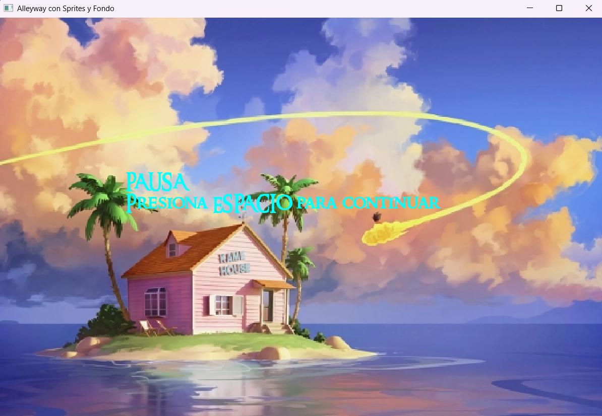
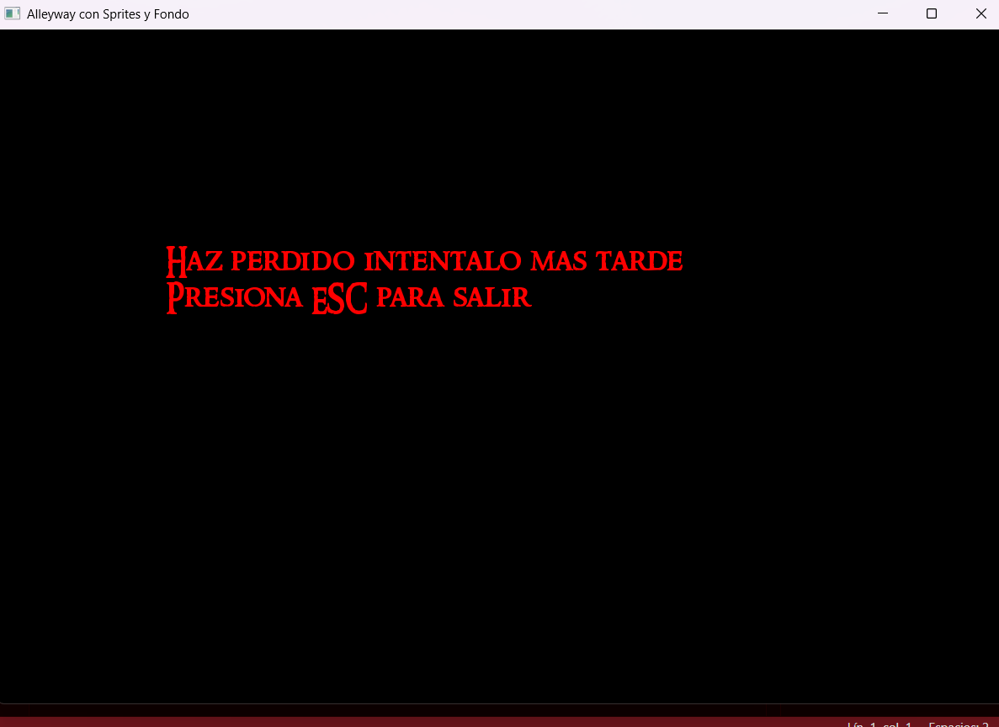

## Explicación del código ProyectoFinal

### Descripción general
Este proyecto es un clon del clásico juego **Alleyway** usando la librería **SFML**. El objetivo es romper todos los bloques de cada nivel usando una pelota que rebota y una paleta controlada por el jugador.

### Herramientas y librerías utilizadas

- **SFML (Simple and Fast Multimedia Library):**  
  Usada para gráficos, audio, manejo de ventanas y eventos.
- **C++ estándar:**  
  Uso de clases, vectores y manejo modular de archivos fuente y cabecera.
- **PlantUML:**  
  Para el diagrama de clases (`diagrama.puml`).

### Estructura de carpetas

- **src/**: Código fuente principal del juego.
- **include/**: Archivos de cabecera con las declaraciones de clases.
- **assets/**: Imágenes, música, efectos de sonido y fuentes.
- **Readme.md**: Documentación del proyecto.
- **diagrama.puml**: Diagrama de clases.

### Componentes principales

- **Constantes globales:**  
  Definen el tamaño de la ventana, bloques, paleta, pelota, cantidad de niveles y vidas.

- **Clases principales:**
  - **Juego:**  
    Clase central que gestiona la ventana, el estado del juego, los niveles, la paleta, la pelota, los bloques, los intentos, los textos, la música y los sonidos.
  - **Nivel:**  
    Controla el nivel actual y el máximo, permite avanzar y reiniciar.
  - **Bloque:**  
    Representa cada bloque del nivel, con color y resistencia variable.
  - **Paleta:**  
    Representa la paleta del jugador, puede moverse horizontalmente y tiene sprite y forma para colisiones.
  - **Pelota:**  
    Representa la pelota, con sprite, forma de colisión y métodos para moverse y rebotar.
  - **Intentos:**  
    Administra los intentos (vidas) del jugador, permitiendo reiniciar, perder y consultar si se agotaron.
  - **Texto:**  
    Administra todos los textos que se muestran en pantalla, adaptando el color y contenido según el estado del juego.

### Recursos multimedia

Este es un ejemplo de texto que da entrada a una lista genérica de elementos:
- Música de fondo para la pantalla de inicio, juego ganado y perdido.
- Música diferente para cada nivel.
- Efecto de sonido al golpear la paleta.
- Efecto de sonido al golpear un bloque.
- Imágenes para el fondo, la paleta y la pelota.
- Fuente personalizada para los textos.

### Estados del juego

Este es un ejemplo de texto que da entrada a una lista numerada:
1. **PRESENTACION** Pantalla de inicio con controles.  
   
2. **JUGANDO** Juego activo, con fondo y lógica de movimiento.
3. **NIVEL_GANADO** Mensaje de nivel superado.
4. **GAMEOVER** Mensaje de derrota.
5. **JUEGO_GANADO** Mensaje de victoria.

### Lógica principal

- **Inicialización:**  
  Carga recursos, crea objetos y muestra la pantalla de inicio con música.
- **Bucle principal:**  
  - Procesa eventos de teclado (mover paleta, pausar, iniciar, avanzar nivel, salir).
  - Cambia la música según el estado del juego.
  - Ajusta la velocidad y tamaño de la paleta según el nivel.
  - Dibuja el fondo solo durante el juego, y pantalla negra en inicio y final.
  - Controla la pausa.  
    
  - Mueve la paleta y la pelota, gestiona rebotes y colisiones.
  - Actualiza y dibuja los bloques, la paleta y la pelota.
  - Cambia de estado si se pierde la pelota, se gana el nivel o el juego.

### Formato de los textos

Los textos en pantalla no tienen signos de puntuación, y su color cambia según el estado:
- Blanco en la pantalla de inicio.
- Amarillo en juego ganado.
- Rojo en juego perdido.  
  

---

**Resumen:**  
El código implementa un juego tipo Arkanoid/Alleyway con niveles progresivos, música y sonidos personalizados, controles simples y una interfaz visual clara y adaptable a distintos estados del juego. Usa la librería SFML para gráficos y audio, y está organizado en clases y módulos para facilitar su mantenimiento y extensión.